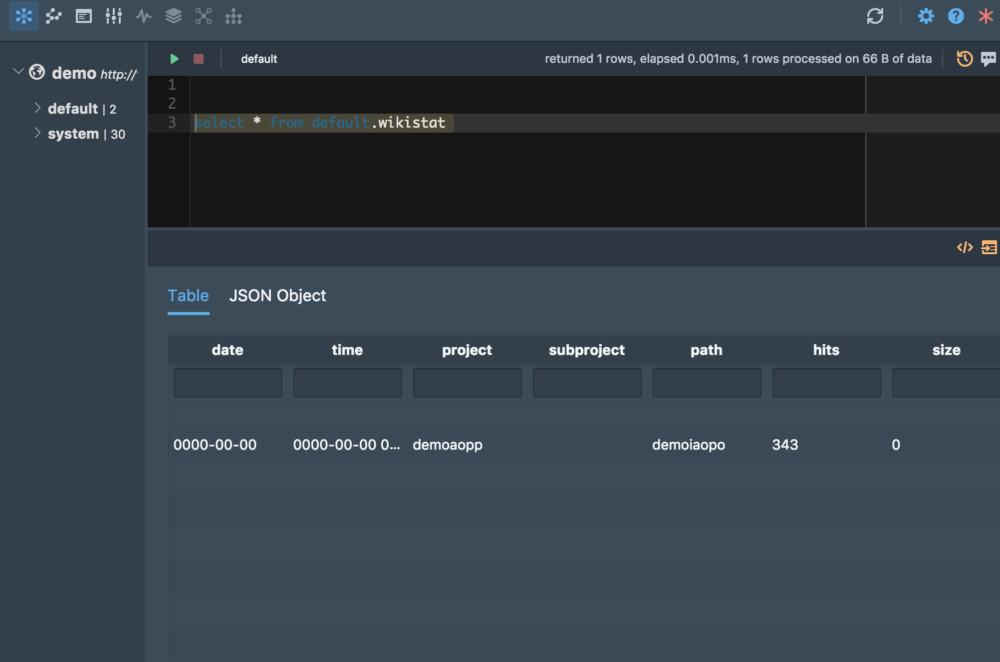

# clickhouse with docker-compose running

## How to run

```code
docker-compose up -d
```

## access address

```code
http interface http://hostip:8123
for native client connect port 9000
```

## how to Connect server

```code
with docker client

docker run -it yandex/clickhouse-client --host ${serverip|hostip}
```

## import data

* create table

```code

CREATE TABLE wikistat
(
    date Date,
    time DateTime,
    project String,
    subproject String,
    path String,
    hits UInt64,
    size UInt64
) ENGINE = MergeTree(date, (path, time), 8192);

```

* insert  data

```code
insert into default.wikistat(project,path,hits) values('demoaopp','demoiaopo',343);
```

* select result

> use ui tools HouseOps https://github.com/HouseOps/HouseOps

```code
select * from default.wikistat;
```

## some images

